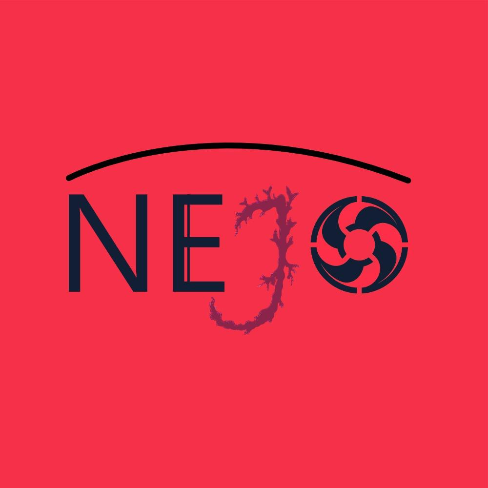

<!DOCTYPE html>
<html lang="es">
<head>
    <meta charset="UTF-8">
    <meta name="viewport" content="width=device-width, initial-scale=1.0">
    <title>Invernadero Inteligente NEJO</title>

    <!-- Bootstrap -->
    <link href="https://cdn.jsdelivr.net/npm/bootstrap@5.3.3/dist/css/bootstrap.min.css" rel="stylesheet">

    
</head>

<body>

<header>
    <!-- LOGO -->
    
    <h1>Invernadero Inteligente NEJO</h1>
</header>

<!-- DESCRIPCIÓN -->

    <h2>Descripción del Proyecto</h2>
    

        Este proyecto busca mantener condiciones óptimas de temperatura y humedad 
        dentro de un invernadero mediante automatización e implementación de IoT.
    

<!-- OBJETIVOS -->

    

        

            <h2>Objetivo General</h2>
            

                Mantener condiciones óptimas de temperatura y humedad para cultivos en un sistema automatizado.
            

        

        

            <h2>Objetivos Específicos</h2>
            <ul>
                <li>Monitorear temperatura y humedad con sensor DHT22</li>
                <li>Automatizar riego con bomba de agua</li>
                <li>Controlar ventilación con extractor</li>
                <li>Visualizar datos en pantalla</li>
            </ul>
        

    

<!-- COMPONENTES -->

    <h2>Componentes del Sistema</h2>
    <ul>
        <li>ESP32 (Microcontrolador)</li>
        <li>Sensor DHT22</li>
        <li>Bomba de agua</li>
        <li>Ventilador</li>
        <li>Pantalla táctil</li>
    </ul>

<!-- IMÁGENES -->

    <h2>Imágenes del Proyecto</h2>
    
      
    

<!-- VIDEO -->

    <h2>Video del Prototipo</h2>
    <video width="600" controls>
        <source src="NEJO.mp4" type="video/mp4">
        Tu navegador no soporta video.
    </video>

<!-- DOCUMENTOS -->

    <h2>Documentación</h2>

    <a href="documentoInvernadero(2).docx" download>
        <button class="btn btn-custom">Descargar Documento 1</button>
    </a>

    <a href="Prototipo .docx" download>
        <button class="btn btn-custom">Descargar Documento 2</button>
    </a>

<footer>
    
© 2026 - Proyecto Invernadero Inteligente NEJO

</footer>

</body>
</html>
